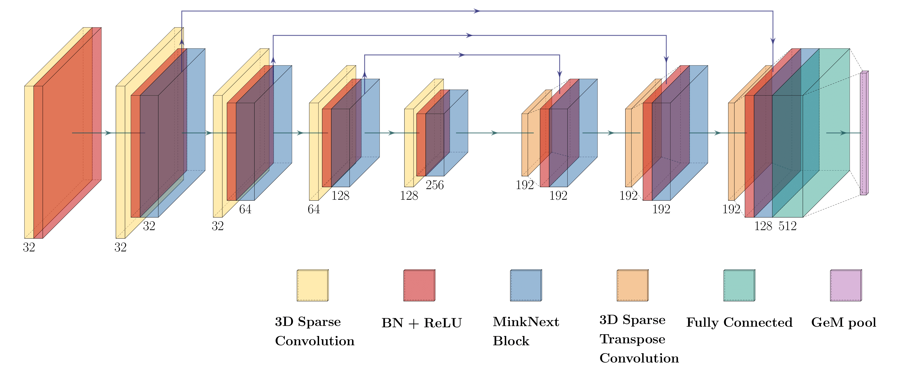

# MinkUNeXt: Point Cloud-based Large-scale Place Recognition using 3D Sparse Convolutions

This paper presents MinkUNeXt, an effective and efficient architecture for place-recognition from point clouds entirely based on the new 3D MinkNeXt Block, a residual block composed of 3D sparse convolutions that follows the philosophy established by recent Transformers but purely using simple 3D convolutions. Feature extraction is performed at different scales by a U-Net encoder-decoder network and the feature aggregation of those features into a single descriptor is carried out by a Generalized Mean Pooling (GeM). The proposed architecture demonstrates that it is possible to surpass the current state-of-the-art by only relying on conventional 3D sparse convolutions without making use of more complex and sophisticated proposals such as Transformers, Attention-Layers or Deformable Convolutions. A thorough assessment of the proposal has been carried out using the Oxford RobotCar and the In-house datasets. As a result, MinkUNeXt proves to outperform other methods in the state-of-the-art.

url: https://arxiv.org/abs/2403.07593


# MinkUNeXt: Point Cloud-based Large-scale Place Recognition using 3D Sparse Convolutions

**Authors:** J.J. Cabrera, A.Sant, A. Gil, C. Viegas, L. Payá
**arXiv:** [2403.07593](https://arxiv.org/abs/2403.07593)

## Introduction

This paper presents MinkUNeXt, an effective and efficient architecture for place-recognition from point clouds entirely based on the new 3D MinkNeXt Block, a residual block composed of 3D sparse convolutions that follows the philosophy established by recent Transformers but purely using simple 3D convolutions. Feature extraction is performed at different scales by a U-Net encoder-decoder network and the feature aggregation of those features into a single descriptor is carried out by a Generalized Mean Pooling (GeM). The proposed architecture demonstrates that it is possible to surpass the current state-of-the-art by only relying on conventional 3D sparse convolutions without making use of more complex and sophisticated proposals such as Transformers, Attention-Layers or Deformable Convolutions. A thorough assessment of the proposal has been carried out using the Oxford RobotCar and the In-house datasets. As a result, MinkUNeXt proves to outperform other methods in the state-of-the-art.
We evaluate the impact of different state-of-the-art CNN models such as ConvNeXt for the proposed localization. Various data augmentation visual effects are separately employed for training the model, and their impact is assessed. The performance of the resulting CNNs is evaluated under real operation conditions, including changes in lighting conditions.




## Comparison with Other Methods

### Average Recall at 1 (AR@1) and at 1% (AR@1%) for Place Recognition Methods Trained Using the Refined Protocol

| Method               | AR@1 (Oxford) | AR@1% (Oxford) | AR@1 (U.S.) | AR@1% (U.S.) | AR@1 (R.A.) | AR@1% (R.A.) | AR@1 (B.D.) | AR@1% (B.D.) | AR@1 (Mean) | AR@1% (Mean) |
|----------------------|---------------|----------------|-------------|--------------|-------------|--------------|-------------|--------------|-------------|--------------|
| PointNetVLAD [1]     | 63.3 | 80.1 | 86.1 | 94.5 | 82.7 | 93.1 | 80.1 | 86.5 | 78.0 | 88.6 |
| PCAN [2]             | 70.7 | 86.4 | 83.7 | 94.1 | 82.5 | 92.5 | 80.3 | 87.0 | 79.3 | 90.0 |
| DAGC [3]             | 71.5 | 87.8 | 86.3 | 94.3 | 82.8 | 93.4 | 81.3 | 88.5 | 80.5 | 91.0 |
| LPD-Net [4]          | 86.6 | 94.9 | 94.4 | 98.9 | 90.8 | 96.4 | 90.8 | 94.4 | 90.7 | 96.2 |
| SOE-Net [5]          | 89.3 | 96.4 | 91.8 | 97.7 | 90.2 | 95.9 | 89.0 | 92.6 | 90.1 | 95.7 |
| MinkLoc3D [6]        | 94.8 | 98.5 | 97.2 | 99.7 | 96.7 | 99.3 | 94.0 | 96.7 | 95.7 | 98.6 |
| PPT-Net [7]          | - | 98.4 | - | 99.7 | - | 99.5 | - | 95.3 | - | 98.2 |
| SVT-Net [8]          | 94.7 | 98.4 | 97.0 | **99.9** | 95.2 | 99.5 | 94.4 | 97.2 | 95.3 | 98.8 |
| TransLoc3D [9]       | 95.0 | 98.5 | 97.5 | 99.8 | 97.3 | 99.7 | 94.8 | 97.4 | 96.2 | 98.9 |
| MinkLoc3Dv2 [10]     | 96.9 | 99.1 | **99.0** | 99.7 | 98.3 | 99.4 | 97.6 | **99.1** | 97.9 | 99.3 |
| **MinkUNeXt (ours)** | **97.7** | **99.3** | 98.7 | **99.9** | **99.4** | **99.9** | **97.7** | 99.0 | **98.3** | **99.5** |

References

[1] Uy, M. A., Pham, Q. H., Hua, B.-S., Nguyen, T., & Yeung, S.-K. (2018). PointNetVLAD: Deep point cloud based retrieval for large-scale place recognition. In Proceedings of the IEEE Conference on Computer Vision and Pattern Recognition (pp. 4470-4479).

[2] Zhang, J., Hua, B.-S., & Yeung, S.-K. (2019). PCAN: 3D Attention Map Learning Using Contextual Information for Point Cloud Based Retrieval. In Proceedings of the IEEE Conference on Computer Vision and Pattern Recognition (pp. 12436-12445).

[3] Sun, Y., & Chen, X. (2020). DAGC: Data-Augmentation and Graph Convolution Network for 3D Point Cloud Classification. IEEE Transactions on Multimedia, 22(9), 2237-2249.

[4] Liu, Z., Tang, H., Lin, Y., & Han, S. (2019). LPD-Net: 3D Point Cloud Learning for Large-Scale Place Recognition and Environment Analysis. In Proceedings of the IEEE International Conference on Computer Vision (pp. 12308-12317).

[5] Xia, Y., Chen, X., & Zhang, H. (2021). SOE-Net: A Self-Attention and Orientation Encoding Network for Point Cloud based Place Recognition. IEEE Transactions on Multimedia, 23, 2751-2763.

[6] Komorowski, J. (2021). MinkLoc3D: Point Cloud Based Large-Scale Place Recognition. In Proceedings of the IEEE International Conference on 3D Vision (pp. 1080-1088).

[7] Hui, L., Yi, L., Wu, Z., Qi, C. R., & Guibas, L. J. (2021). PPT-Net: Point Pair Transformation Network for Efficient Point Cloud Registration. In Proceedings of the IEEE Conference on Computer Vision and Pattern Recognition (pp. 1578-1587).

[8] Fan, L., Pang, J., Yang, Y., & Tian, Y. (2022). SVT-Net: Supervised Volumetric Transformer Network for Place Recognition Using 3D Point Clouds. IEEE Transactions on Neural Networks and Learning Systems.

[9] Xu, H., Zhang, J., & Yeung, S.-K. (2021). TransLoc3D: A Transformer Network for Place Recognition using 3D Point Clouds. In Proceedings of the IEEE Conference on Computer Vision and Pattern Recognition (pp. 3677-3686).

[10] Komorowski, J. (2022). Improving Large-Scale Place Recognition Using MinkLoc3D and Sparse Voxelization. IEEE Transactions on Image Processing, 31, 3054-3068.


## Citation
If you find this work useful, please consider citing:

      @misc{cabrera2024minkunext,
            title={MinkUNeXt: Point Cloud-based Large-scale Place Recognition using 3D Sparse Convolutions},
            author={J. J. Cabrera and A. Santo and A. Gil and C. Viegas and L. Payá},
            year={2024},
            eprint={2403.07593},
            archivePrefix={arXiv},
            primaryClass={cs.CV}
      }


## Repository Structure

The repository is structured as follows:

    ├── config
    │ ├── config.py
    │ ├── general_parameters.yaml
    ├── datasets
    │ ├── pointnetvlad
    │ ├── augmentation.py
    │ ├── base_datasets.py
    │ ├── dataset_utils.py
    │ ├── quantization.py
    │ ├── samples.py
    ├── eval
    │ ├── pnv_evaluate.py
    ├── losses
    │ ├── truncated_smoothap.py
    ├── media
    ├── model
    │ ├── minkunext.py
    │ ├── residual_blocks.py
    ├── training
    │ ├── wandb
    │ ├── train.py
    │ ├── trainer.py
    ├── visualization
    ├── wandb
    ├── README.md
    └── requirements.txt

## Getting Started

### Prerequisites

Ensure you have the following installed:
- Python 3.8+
- Torch
- NumPy
- Matplotlib
- Minkowski Engine

You can install the required packages using:

    pip install -r requirements.txt

## Usage

### Datasets

**MinkUNeXt** is trained on a subset of Oxford RobotCar and In-house (U.S., R.A., B.D.) datasets introduced in
*PointNetVLAD: Deep Point Cloud Based Retrieval for Large-Scale Place Recognition* paper ([link](https://arxiv.org/pdf/1804.03492)).
There are two training datasets:
- Baseline Dataset - consists of a training subset of Oxford RobotCar
- Refined Dataset - consists of training subset of Oxford RobotCar and training subset of In-house

For dataset description see PointNetVLAD paper or github repository ([link](https://github.com/mikacuy/pointnetvlad)).

You can download training and evaluation datasets from 
[here](https://drive.google.com/open?id=1rflmyfZ1v9cGGH0RL4qXRrKhg-8A-U9q) 
([alternative link](https://drive.google.com/file/d/1-1HA9Etw2PpZ8zHd3cjrfiZa8xzbp41J/view?usp=sharing)). 


### Configuration:
Adjust the dataset path (`dataset_folder`) of the downloaded dataset.
Stablish the weights directory at (`weights_path`) and you can also modify the training parameters in config/general_parameters.yaml as needed.
    
    dataset_folder: '/media/arvc/DATOS/Juanjo/Datasets/benchmark_datasets'
    cuda_device: 'cuda:1' # 'cuda:0' or 'cuda:1'
    
    quantization_size: 0.01
    num_workers: 8
    batch_size: 2048
    batch_size_limit: 2048
    batch_expansion_rate: Null
    batch_expansion_th: Null
    batch_split_size: 32
    val_batch_size: 32
    
    optimizer: 'Adam' # Adam or AdamW
    initial_lr: 0.001
    scheduler: 'MultiStepLR' # MultiStepLR or CosineAnnealingLR or Null
    aug_mode: 1 # 1 if yes
    weight_decay: 0.0001
    loss: 'TruncatedSmoothAP'
    margin: Null
    tau1: 0.01
    positives_per_query: 4
    similarity: 'euclidean' # 'cosine' or 'euclidean'
    normalize_embeddings: False
    
    protocol: 'refined' # baseline or refined
    baseline:
      epochs: 400
      scheduler_milestones: [250, 350]
      train_file: training_queries_baseline2.pickle
      val_file: test_queries_baseline2.pickle
    
    refined:
      epochs: 500
      scheduler_milestones: [350, 450]
      train_file: training_queries_refine2.pickle
      val_file: test_queries_baseline2.pickle
    
    print:
      model_info: True
      number_of_parameters: True
      debug: False
    
    evaluate:
      weights_path: '/home/arvc/Juanjo/develop/MinkUNeXt/weights/model_MinkUNeXt_refined.pth'

Before the network training or evaluation, run the below code to generate pickles with positive and negative point clouds for each anchor point cloud.  

```generate pickles
# Generate training tuples for the Baseline Dataset
python3 datasets/pointnetvlad/generate_training_tuples_baseline.py 

# Generate training tuples for the Refined Dataset
python3 datasets/pointnetvlad/generate_training_tuples_refine.py 

# Generate evaluation tuples
python3 datasets/pointnetvlad/generate_test_sets.py
```

### Training:
Before training edit the configuration file `genenal_parameters.yaml` in which you can decide the `protocol` (baseline or refined)
Then run:

    python3 training/train.py

### Pre-trained model
Pretrained model is available in `weights` directory
- `model_MinkUNeXt_refined.pth` trained on the Refined Dataset

### Evaluation:
Before the evaluation edit the configuration file `genenal_parameters.yaml` and select the path to the model's weights `weights_path`.
Then evaluate the trained model:

    python3 eval/pnv_evaluate.py 


