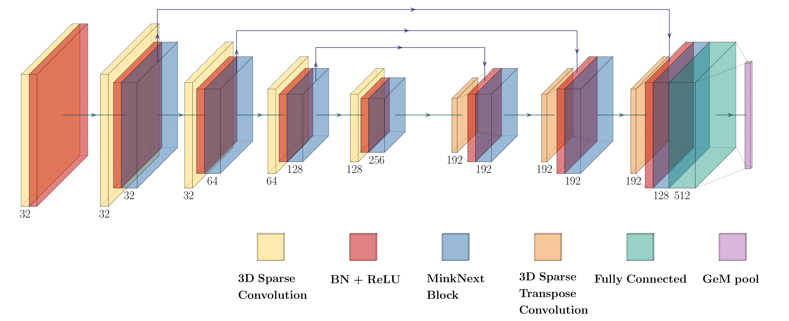

# MinkUNeXt: Point Cloud-based Large-scale Place Recognition using 3D Sparse Convolutions

**Authors:** J.J. Cabrera, A.Santo, A. Gil, C. Viegas, L. Payá

- **arXiv:** [2403.07593](https://arxiv.org/abs/2403.07593)
- **Project Page:** [juanjo-cabrera.github.io/projects-MinkUNeXt/](https://juanjo-cabrera.github.io/projects-MinkUNeXt/)
- **Published in Array:** [sciencedirect.com](https://www.sciencedirect.com/science/article/pii/S2590005625001961)

## Introduction

This paper presents MinkUNeXt, an effective and efficient architecture for place-recognition from point clouds entirely based on the new 3D MinkNeXt Block, a residual block composed of 3D sparse convolutions that follows the philosophy established by recent Transformers but purely using simple 3D convolutions. Feature extraction is performed at different scales by a U-Net encoder-decoder network and the feature aggregation of those features into a single descriptor is carried out by a Generalized Mean Pooling (GeM). The proposed architecture demonstrates that it is possible to surpass the current state-of-the-art by only relying on conventional 3D sparse convolutions without making use of more complex and sophisticated proposals such as Transformers, Attention-Layers or Deformable Convolutions. A thorough assessment of the proposal has been carried out using the Oxford RobotCar, the In-house, the KITTI and the USyd datasets. As a result, MinkUNeXt proves to outperform other methods in the state-of-the-art.




## Comparison with Other Methods

### Evaluation results in terms of average recall at 1 (AR@1) and at 1% (AR@1%) of place recognition methods trained using the baseline protocol.

| Method | AR@1 (Oxford) | AR@1% (Oxford) | AR@1 (U.S.) | AR@1% (U.S.) | AR@1 (R.A.) | AR@1% (R.A.) | AR@1 (B.D.) | AR@1% (B.D.) | AR@1 (Mean) | AR@1% (Mean) |
| :--- | :---: | :---: | :---: | :---: | :---: | :---: | :---: | :---: | :---: | :---: |
| PointNetVLAD [1] | 62.8 | 80.3 | 63.2 | 72.6 | 56.1 | 60.3 | 57.2 | 65.3 | 59.8 | 69.6 |
| PCAN [2] | 69.1 | 83.8 | 62.4 | 79.1 | 56.9 | 71.2 | 58.1 | 66.8 | 61.6 | 75.2 |
| DAGC [3] | - | 87.5 | - | 83.5 | - | 75.7 | - | 71.2 | - | 79.5 |
| BPT [4] | 85.7 | 93.3 | 80.5 | 89.3 | 77.4 | 86.6 | 74.1 | 78.5 | 79.4 | 86.9 |
| Retriever [5] | - | 91.9 | - | 91.9 | - | 87.4 | - | 85.5 | - | 89.2 |
| RPR-Net [6] | 81.0 | 92.2 | 83.2 | 94.5 | 83.3 | 91.3 | 80.4 | 86.4 | 82.0 | 91.1 |
| LPD-Net [7] | 86.3 | 94.9 | 87.0 | 96.0 | 83.1 | 90.5 | 82.5 | 89.1 | 84.7 | 92.6 |
| HiTPR [8] | 87.8 | 94.6 | 86.0 | 94.0 | 81.3 | 89.1 | 81.8 | 88.3 | 84.2 | 91.5 |
| EPC-Net [9] | 86.2 | 94.7 | - | 96.5 | - | 88.6 | - | 84.9 | - | 91.2 |
| E$^{2}$PN-GeM [10] | 84.8 | 93.2 | 88.1 | 95.3 | 83.7 | 90.5 | 83.3 | 87.7 | 85.0 | 91.7 |
| SOE-Net [11] | - | 96.4 | - | 93.2 | - | 91.5 | - | 88.5 | - | 92.4 |
| MinkLoc3D [12] | 93.0 | 97.9 | 86.7 | 95.0 | 80.4 | 91.2 | 81.5 | 88.5 | 85.4 | 93.2 |
| HiBi-Net [13] | 87.5 | 95.1 | 87.8 | - | 85.8 | - | 83.0 | - | 86.0 | - |
| NDT-Transformer [14] | 93.8 | 97.7 | - | - | - | - | - | - | - | - |
| PPT-Net [15] | 93.5 | 98.1 | 90.1 | 97.5 | 84.1 | 93.3 | 84.6 | 90.0 | 88.1 | 94.7 |
| SVT-Net [16] | 93.7 | 97.8 | 90.1 | 96.5 | 84.3 | 92.7 | 85.5 | 90.7 | 88.4 | 94.4 |
| TransLoc3D [17] | 95.0 | 98.5 | - | 94.9 | - | 91.5 | - | 88.4 | - | 93.3 |
| MinkLoc3Dv2 [18] | **96.3** | **98.9** | 90.9 | 96.7 | 86.5 | 93.8 | 86.3 | 91.2 | 90.0 | 95.1 |
| KPPR [19] | 91.5 | 97.1 | - | 98.0 | - | **95.1** | - | **92.1** | - | 95.6 |
| ComPoint [20] | 69.3 | 83.7 | 67.3 | 80.6 | 58.1 | 72.2 | 62.6 | 69.2 | 64.3 | 76.4 |
| CASSPR [21] | 95.6 | 98.5 | **92.9** | 97.9 | **89.5** | 94.8 | **87.9** | **92.1** | **91.5** | **95.8** |
| Point-Wave [22] | 92.4 | 97.5 | 92.8 | **98.6** | 86.2 | 94.5 | 85.5 | 90.8 | 89.2 | 95.3 |
| **MinkUNeXt (ours)** | 95.8 | 98.6 | 89.9 | 96.5 | 87.4 | 93.3 | 86.6 | 91.3 | 89.9 | 95.0 |


### Evaluation results in terms of average recall at 1 (AR@1) and at 1% (AR@1%) of place recognition methods trained using the refined protocol.

| Method | AR@1 (Oxford) | AR@1% (Oxford) | AR@1 (U.S.) | AR@1% (U.S.) | AR@1 (R.A.) | AR@1% (R.A.) | AR@1 (B.D.) | AR@1% (B.D.) | AR@1 (Mean) | AR@1% (Mean) |
| :--- | :---: | :---: | :---: | :---: | :---: | :---: | :---: | :---: | :---: | :---: |
| PointNetVLAD [1] | 63.3 | 80.1 | 86.1 | 94.5 | 82.7 | 93.1 | 80.1 | 86.5 | 78.0 | 88.6 |
| PCAN [2] | 70.7 | 86.4 | 83.7 | 94.1 | 82.5 | 92.5 | 80.3 | 87.0 | 79.3 | 90.0 |
| DAGC [3] | 71.5 | 87.8 | 86.3 | 94.3 | 82.8 | 93.4 | 81.3 | 88.5 | 80.5 | 91.0 |
| LPD-Net [7] | 86.6 | 94.9 | 94.4 | 98.9 | 90.8 | 96.4 | 90.8 | 94.4 | 90.7 | 96.2 |
| SOE-Net [11] | 89.3 | 96.4 | 91.8 | 97.7 | 90.2 | 95.9 | 89.0 | 92.6 | 90.1 | 95.7 |
| MinkLoc3D [12] | 94.8 | 98.5 | 97.2 | 99.7 | 96.7 | 99.3 | 94.0 | 96.7 | 95.7 | 98.6 |
| PPT-Net [15] | - | 98.4 | - | 99.7 | - | 99.5 | - | 95.3 | - | 98.2 |
| SVT-Net [16] | 94.7 | 98.4 | 97.0 | **99.9** | 95.2 | 99.5 | 94.4 | 97.2 | 95.3 | 98.8 |
| TransLoc3D [17] | 95.0 | 98.5 | 97.5 | 99.8 | 97.3 | 99.7 | 94.8 | 97.4 | 96.2 | 98.9 |
| MinkLoc3Dv2 [18] | 96.9 | 99.1 | **99.0** | 99.7 | 98.3 | 99.4 | 97.6 | **99.1** | 97.9 | 99.3 |
| ComPoint [20] | 69.3 | 84.7 | 87.2 | 95.8 | 85.6 | 92.5 | 82.6 | 87.6 | 81.2 | 90.2 |
| CASSPR [21] | 95.6 | 98.8 | 98.3 | 99.9 | 96.6 | 98.5 | 93.6 | 96.9 | 96.0 | 98.5 |
| **MinkUNeXt (ours)** | **97.7** | **99.3** | 98.7 | **99.9** | **99.4** | **99.9** | **97.7** | 99.0 | **98.3** | **99.5** |


### Evaluation results in terms of average recall at 1 (AR@1) and at 1% (AR@1%) in KITTI and USyd when training the models both in the baseline and refined protocols, in which only Oxford or Oxford and In-House datasets are used to train.

| Method | Trained with | AR@1 (KITTI) | AR@1% (KITTI) | AR@1 (USyd) | AR@1% (USyd) |
| :--- | :--- | :---: | :---: | :---: | :---: |
| MinkLoc3Dv2 [18] | Baseline protocol | 75.0 | 79.8 | 77.5 | 90.1 |
| MinkLoc3Dv2 [18] | Refined protocol | 81.0 | 81.0 | 78.6 | 89.7 |
| CASSPR [21] | Baseline protocol | 64.3 | 65.5 | 73.8 | 83.2 |
| CASSPR [21] | Refined protocol | 76.2 | 77.4 | 73.9 | 87.0 |
| **MinkUNeXt (ours)** | **Baseline protocol** | **82.1** | **84.5** | **82.4** | **92.7** |
| **MinkUNeXt (ours)** | **Refined protocol** | **90.5** | **94.1** | **82.6** | **93.2** |

## References

[1] M. A. Uy, G. H. Lee, PointNetVLAD: Deep point cloud based retrieval for large-scale place recognition, in: Proceedings of the IEEE conference on computer vision and pattern recognition, 2018, pp. 4470–4479.

[2] W. Zhang, C. Xiao, Pcan: 3D attention map learning using contextual information for point cloud based retrieval, in: Proceedings of the IEEE/CVF Conference on Computer Vision and Pattern Recognition, 2019, pp. 12436–12445.

[3] Q. Sun, H. Liu, J. He, Z. Fan, X. Du, Dagc: Employing dual attention and graph convolution for point cloud based place recognition, in: Proceedings of the 2020 International Conference on Multimedia Retrieval, 2020, pp. 224–232.

[4] Z. Hou, Y. Shang, T. Gao, Y. Yan, BPT: binary point cloud transformer for place recognition, arXiv preprint arXiv:2303.01166 (2023).

[5] L. Wiesmann, R. Marcuzzi, C. Stachniss, J. Behley, Retriever: Point cloud retrieval in compressed 3D maps, in: 2022 International Conference on Robotics and Automation (ICRA), IEEE, 2022, pp. 10925–10932.

[6] Z. Fan, Z. Song, W. Zhang, H. Liu, J. He, X. Du, RPR-Net: A point cloud-based rotation-aware large scale place recognition network, in: European Conference on Computer Vision, Springer, 2022, pp. 709–725.

[7] Z. Liu, S. Zhou, C. Suo, P. Yin, W. Chen, H. Wang, H. Li, Y.-H. Liu, LPD-Net: 3D point cloud learning for large-scale place recognition and environment analysis, in: Proceedings of the IEEE/CVF International Conference on Computer Vision, 2019, pp. 2831–2840.

[8] Z. Hou, Y. Yan, C. Xu, H. Kong, in: 2022 International Conference on Robotics and Automation (ICRA), IEEE, 2022, pp. 2612–2618.

[9] L. Hui, M. Cheng, J. Xie, J. Yang, M.-M. Cheng, Efficient 3D point cloud feature learning for large-scale place recognition, IEEE Transactions on Image Processing 31 (2022) 1258–1270.

[10] C. E. Lin, J. Song, R. Zhang, M. Zhu, M. Ghaffari, Se (3)-equivariant point cloud-based place recognition, in: Conference on Robot Learning, PMLR, 2023, pp. 1520–1530.

[11] Y. Xia, Y. Xu, S. Li, R. Wang, J. Du, D. Cremers, U. Stilla, SOE-Net: A self-attention and orientation encoding network for point cloud based place recognition, in: Proceedings of the IEEE/CVF Conference on computer vision and pattern recognition, 2021, pp. 11348–11357.

[12] J. Komorowski, Minkloc3D: Point cloud based large-scale place recognition, in: Proceedings of the IEEE/CVF Winter Conference on Applications of Computer Vision, 2021, pp. 1790–1799.

[13] D. W. Shu, J. Kwon, Hierarchical bidirected graph convolutions for large-scale 3D point cloud place recognition, IEEE Transactions on Neural Networks and Learning Systems (2023).

[14] Z. Zhou, C. Zhao, D. Adolfsson, S. Su, Y. Gao, T. Duckett, L. Sun, NDT-transformer: Large-scale 3D point cloud localisation using the normal distribution transform representation, in: 2021 IEEE International Conference on Robotics and Automation (ICRA), IEEE, 2021, pp. 5654–5660.

[15] L. Hui, H. Yang, M. Cheng, J. Xie, J. Yang, Pyramid point cloud transformer for large-scale place recognition, in: Proceedings of the IEEE/CVF International Conference on Computer Vision, 2021, pp. 6098–6107.

[16] Z. Fan, Z. Song, H. Liu, Z. Lu, J. He, X. Du, SVT-Net: Super lightweight sparse voxel transformer for large scale place recognition, in: Proceedings of the AAAI Conference on Artificial Intelligence, Vol. 36, 2022, pp. 551–560.

[17] T.-X. Xu, Y.-C. Guo, Z. Li, G. Yu, Y.-K. Lai, S.-H. Zhang, TransLoc3D: Point cloud based large-scale place recognition using adaptive receptive fields, arXiv preprint arXiv:2105.11605 (2021).

[18] J. Komorowski, Improving point cloud based place recognition with ranking-based loss and large batch training, in: 2022 26th International Conference on Pattern Recognition (ICPR), IEEE, 2022, pp. 3699–3705.

[19] L. Wiesmann, L. Nunes, J. Behley, C. Stachniss, KPPR: Exploiting momentum contrast for point cloud-based place recognition, IEEE Robotics and Automation Letters 8 (2) (2022) 592–599.

[20] R. Zhang, G. Li, W. Gao, T. H. Li, Compoint: Can complex-valued representation benefit point cloud place recognition?, IEEE Transactions on Intelligent Transportation Systems 25 (7) (2024) 7494–7507.

[21] Y. Xia, M. Gladkova, R. Wang, Q. Li, U. Stilla, J. F. Henriques, D. Cremers, Casspr: Cross attention single scan place recognition, in: Proceedings of the IEEE/CVF international conference on computer vision, 2023, pp. 8461–8472.

[22] G. Li, R. Zhang, A point is a wave: point-wave network for place recognition, in: ICASSP 2023-2023 IEEE International Conference on Acoustics, Speech and Signal Processing (ICASSP), IEEE, 2023, pp. 1–5.

## Citation
If you find this work useful, please consider citing:

      @article{cabrera2025minkunext,
      title = {MinkUNeXt: Point cloud-based large-scale place recognition using 3D sparse convolutions},
      journal = {Array},
      volume = {28},
      pages = {100569},
      year = {2025},
      issn = {2590-0056},
      doi = {https://doi.org/10.1016/j.array.2025.100569},
      url = {https://www.sciencedirect.com/science/article/pii/S2590005625001961},
      author = {Juan José Cabrera and Antonio Santo and Arturo Gil and Carlos Viegas and Luis Payá},
      keywords = {Place recognition, LiDAR, Point cloud embedding, 3D sparse convolutions},
      abstract = {This paper presents MinkUNeXt, an effective and efficient architecture for place-recognition from point clouds entirely based on the new 3D MinkNeXt Block, a residual block composed of 3D sparse convolutions that follows the philosophy established by recent Transformers but purely using simple 3D convolutions. Feature extraction is performed at different scales by a U-Net encoder–decoder network and the feature aggregation of those features into a single descriptor is carried out by a Generalized Mean Pooling (GeM). The proposed architecture demonstrates that it is possible to surpass the current state-of-the-art by only relying on conventional 3D sparse convolutions without making use of more complex and sophisticated proposals such as Transformers, Attention-Layers or Deformable Convolutions. A thorough assessment of the proposal has been carried out using the Oxford RobotCar, the In-house, the KITTI and the USyd datasets. As a result, MinkUNeXt proves to outperform other methods in the state-of-the-art. The implementation is publicly available at https://juanjo-cabrera.github.io/projects-MinkUNeXt/.}
      }


## Repository Structure

The repository is structured as follows:

    ├── config
    │ ├── config.py
    │ ├── general_parameters.yaml
    ├── datasets
    │ ├── pointnetvlad
    │ ├── augmentation.py
    │ ├── base_datasets.py
    │ ├── dataset_utils.py
    │ ├── quantization.py
    │ ├── samples.py
    ├── eval
    │ ├── pnv_evaluate.py
    ├── losses
    │ ├── truncated_smoothap.py
    ├── media
    ├── model
    │ ├── minkunext.py
    │ ├── residual_blocks.py
    ├── training
    │ ├── wandb
    │ ├── train.py
    │ ├── trainer.py
    ├── visualization
    ├── wandb
    ├── README.md
    └── requirements.txt

## Getting Started

### Prerequisites

Ensure you have the following installed:
- Python 3.8+
- Torch
- NumPy
- Matplotlib
- Minkowski Engine

You can install the required packages using:

    pip install -r requirements.txt

## Usage

### Datasets

**MinkUNeXt** is trained on a subset of Oxford RobotCar and In-house (U.S., R.A., B.D.) datasets introduced in
*PointNetVLAD: Deep Point Cloud Based Retrieval for Large-Scale Place Recognition* paper ([link](https://arxiv.org/pdf/1804.03492)).
There are two training datasets:
- Baseline Dataset - consists of a training subset of Oxford RobotCar
- Refined Dataset - consists of training subset of Oxford RobotCar and training subset of In-house

For dataset description see PointNetVLAD paper or github repository ([link](https://github.com/mikacuy/pointnetvlad)).

You can download training and evaluation datasets from 
[here](https://drive.google.com/open?id=1rflmyfZ1v9cGGH0RL4qXRrKhg-8A-U9q) 
([alternative link](https://drive.google.com/file/d/1-1HA9Etw2PpZ8zHd3cjrfiZa8xzbp41J/view?usp=sharing)). 


### Configuration:
Adjust the dataset path (`dataset_folder`) of the downloaded dataset.
Stablish the weights directory at (`weights_path`) and you can also modify the training parameters in config/general_parameters.yaml as needed.
    
    dataset_folder: '/media/arvc/DATOS/Juanjo/Datasets/benchmark_datasets'
    cuda_device: 'cuda:1' # 'cuda:0' or 'cuda:1'
    
    quantization_size: 0.01
    num_workers: 8
    batch_size: 2048
    batch_size_limit: 2048
    batch_expansion_rate: Null
    batch_expansion_th: Null
    batch_split_size: 32
    val_batch_size: 32
    
    optimizer: 'Adam' # Adam or AdamW
    initial_lr: 0.001
    scheduler: 'MultiStepLR' # MultiStepLR or CosineAnnealingLR or Null
    aug_mode: 1 # 1 if yes
    weight_decay: 0.0001
    loss: 'TruncatedSmoothAP'
    margin: Null
    tau1: 0.01
    positives_per_query: 4
    similarity: 'euclidean' # 'cosine' or 'euclidean'
    normalize_embeddings: False
    
    protocol: 'refined' # baseline or refined
    baseline:
      epochs: 400
      scheduler_milestones: [250, 350]
      train_file: training_queries_baseline2.pickle
      val_file: test_queries_baseline2.pickle
    
    refined:
      epochs: 500
      scheduler_milestones: [350, 450]
      train_file: training_queries_refine2.pickle
      val_file: test_queries_baseline2.pickle
    
    print:
      model_info: True
      number_of_parameters: True
      debug: False
    
    evaluate:
      weights_path: '/home/arvc/Juanjo/develop/MinkUNeXt/weights/model_MinkUNeXt_refined.pth'

Before the network training or evaluation, run the below code to generate pickles with positive and negative point clouds for each anchor point cloud.  

```generate pickles
# Generate training tuples for the Baseline Dataset
python3 datasets/pointnetvlad/generate_training_tuples_baseline.py 

# Generate training tuples for the Refined Dataset
python3 datasets/pointnetvlad/generate_training_tuples_refine.py 

# Generate evaluation tuples
python3 datasets/pointnetvlad/generate_test_sets.py
```

### Training:
Before training edit the configuration file `genenal_parameters.yaml` in which you can decide the `protocol` (baseline or refined)
Then run:

    python3 training/train.py

### Pre-trained model
Pretrained models are available at https://drive.google.com/drive/folders/1ZpaC2MIX6r_vPqLsd4fgi3ZZ46PpL6dH?usp=sharing
The weights provided correspond to MinkUNeXt trained with the baseline protocol and the refined protocol: `model_MinkUNeXt_baseline.pth`, `model_MinkUNeXt_refined.pth`.

### Evaluation:
Before the evaluation edit the configuration file `genenal_parameters.yaml` and add the path to the model's weights previously downloaded.
Then evaluate the provided model:

    python3 eval/pnv_evaluate.py 


## Acknowledgements

The Ministry of Science, Innovation and Universities (Spain) has funded this work through FPU21/04969 (J.J. Cabrera). This work is part of the projects PID2023-149575OB-I00, funded by MICIU/AEI/10.13039/501100011033 and by FEDER UE, and CIPROM/2024/8, funded by Generalitat Valenciana.

